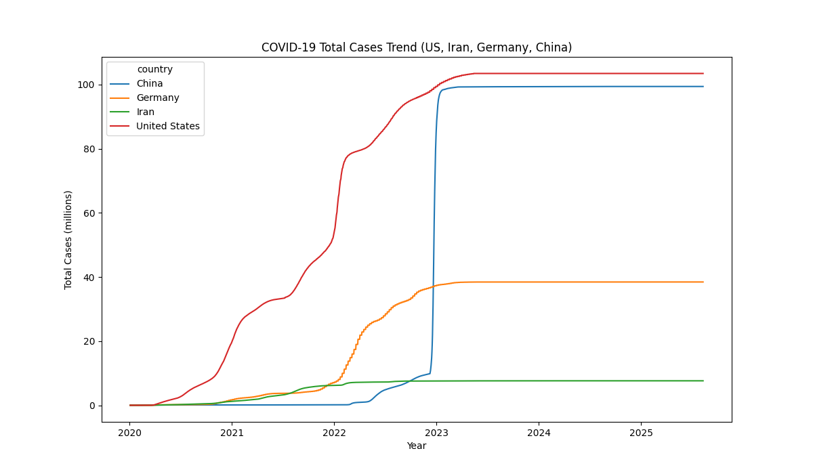

# COVID-19 Global Data Analysis & Visualization  

## About  

COVID-19 (Coronavirus Disease 2019) is an infectious disease caused by the SARS-CoV-2 virus, which spread worldwide starting in late 2019. It has had profound global impacts on public health, society, and economies.[who.int](https://www.who.int/health-topics/coronavirus#tab=tab_1) 

This project focuses on analyzing and visualizing **COVID-19 global data**, including cases, deaths, recoveries, vaccinations, and population statistics. The goal is to demonstrate skills in **data collection, cleaning, exploratory data analysis (EDA), and visualization** using Python and modern libraries.  


## Features  

 **Scraping** data from [worldometers](https://www.worldometers.info/) using Selenium  
 **Merging & Cleaning** datasets (adding vaccination data, ISO3 codes, handling missing values)  
**Visualizations**:  
- Barplot → Top 10 countries with the highest deaths  
- Scatterplot → Relationship between population and deaths  
- Lineplot → COVID-19 cases trends in USA, Iran, Germany and China  
- Heatmap → Correlation between variables  
- Choropleth Map → Interactive map built with Dash + Plotly  


## Project Structure  

```
covid19/
│
├── crs/                
│   ├── 01_scraping.py
│   ├── 02_clean_merge.py
│   ├── 03_visualization_top10_deaths.py
│   ├── 04_visualization_Scatterplot_pop_death.py
│   ├── 05_clean_cases_deaths.py
│   ├── 06_visualization_totalCasesTrend.py
│   ├── 07_visualization.py
│   ├── 08_clean_add_iso.py
│   └── 09_plotly.py
│
├── data/               # Datasets
│   ├── 01_scraped_data.csv
│   ├── 02_merge_data.csv
│   ├── 03_cases_deaths.csv
│   ├── 08_with_iso.csv
│   └── vaccinations_global.csv
│
├── outputs/            
│   ├── top10_deaths.png
│   ├── Scatterplot_pop_death.png
│   ├── TotalCasesTrend.png
│   └── correlationHeatmap.png
│
|___ assets/
|    ├── mapgif.gif
|
|___ LICENSE
|
└── README.md

```


## Sample Visualizations  
**Scatterplot (Population vs Deaths)**  


*This scatterplot explores the relationship between population size and total deaths caused by COVID-19. It helps assess whether larger populations necessarily resulted in higher fatalities.*  

---

**Lineplot (Cases Over Time)**


*This line plot compares the progression of total COVID-19 cases in the United States, Iran, Germany, and China over time.*

---

**Heatmap (Correlation)**

 
*The correlation heatmap reveals the relationships between key numerical variables such as cases, deaths, recoveries, and population. It highlights which factors are strongly associated, providing valuable insights for further statistical or predictive analysis.*

---
**Barplot (Top 10 Deaths)** 

 
*This bar chart highlights the 10 countries with the highest total number of COVID-19 deaths. It provides a quick global comparison, showing which regions were most severely impacted by mortality.* 

---
**Interactive Map (Dash + Plotly)**


*The interactive dashboard built with **Dash** and **Plotly** allows users to explore COVID-19 data on a world map.*  
*By selecting different metrics (Total Cases, Total Deaths, or Total Recovered), the map updates dynamically to display country-level statistics with color gradients.*  

- *Hovering over a country shows detailed information.*  
- *The map is fully interactive (zoom, pan, hover).*  
- *Color scales adapt based on the selected metric, making trends easy to compare.* 

*This visualization provides an intuitive and engaging way to analyze the global impact of COVID-19.* 


## Built With  

- **Python 3.11**  
- Pandas  
- Seaborn  
- Matplotlib  
- Plotly Express  
- Dash  
- Selenium  


## Data Sources  

- [Worldometers COVID-19 Data](https://www.worldometers.info/coronavirus/)  
- [Our World in Data - Vaccinations](https://ourworldindata.org/covid-vaccinations)  

---

## License 

[@MIT](LICENSE)